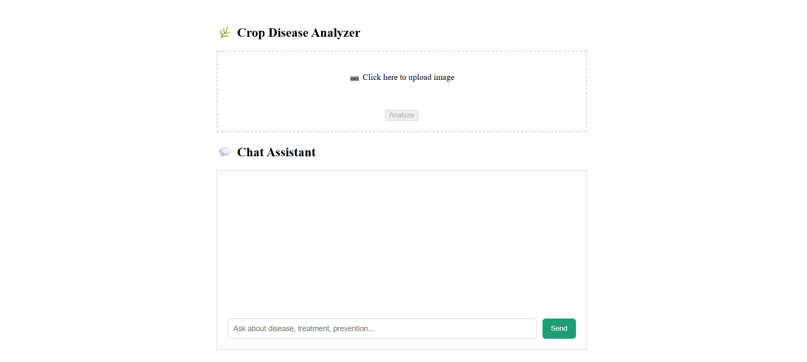

# 🌱 ARNA Bot — Agricultural Real-time Neural Advisor

ARNA is an AI-powered assistant for farmers: upload a photo of a crop leaf and it detects plant disease with a CNN/ONNX model, recommends a fertilizer, and answers agriculture questions through a Gemini-powered RAG chatbot.

<!--  -->

<!-- 

 -->

---

## ✨ Features

- 🩺 **Disease detection** — upload a leaf image, get a disease label + confidence score from an ONNX-exported CNN.
- 🧪 **Fertilizer recommendation** — maps the detected disease to a recommended fertilizer using a trained intent classifier.
- 💬 **RAG chatbot** — a Gemini + FAISS retrieval-augmented chatbot answers farming questions from a curated knowledge base.
- ⚡ **FastAPI backend** with a React (Rsbuild) frontend, served together from a single app.
- 🐳 **Dockerized** for one-command deployment.

## 🧱 Tech stack

| Layer | Tech |
|---|---|
| Backend | FastAPI, Uvicorn, ONNX Runtime, OpenCV, scikit-learn |
| RAG / LLM | LangChain, FAISS, Sentence-Transformers, Google Gemini API |
| Frontend | React, Rsbuild |
| Infra | Docker, Docker Compose, Render |
| Tests | Pytest, GitHub Actions CI |

## 📁 Project structure

```
ARNA_Bot/
├── Backend/
│   └── src/
│       ├── main.py                     # FastAPI app & routes
│       ├── disease_identification.py   # ONNX inference
│       ├── fertilizer_recomendation.py # Fertilizer classifier
│       ├── LLM.py                      # Gemini RAG chat
│       ├── Rag.py                      # FAISS vector store
│       ├── Models/                     # Trained model files
│       ├── Dataset/                    # RAG source data
│       ├── frontend/                   # Pre-built React static site
│       └── requirements.txt
├── Frontend/                           # React (Rsbuild) source
├── tests/                              # Pytest suite
├── Dockerfile
├── docker-compose.yml
├── .env.example
└── render.yaml
```

## 🚀 Getting started

### Prerequisites

- Python 3.10+
- Node.js 18+ (only if you want to edit/rebuild the frontend)
- A [Google Gemini API key](https://aistudio.google.com/app/apikey)
- Docker (optional, for containerized run)

### 1. Clone the repo

```bash
git clone https://github.com/Rohith-Kumar-RK/ARNA_Bot.git
cd ARNA_Bot
```

### 2. Configure environment variables

Copy the example file and add your key:

```bash
cp .env.example .env
```

```env
API_TOKEN=your_gemini_api_key_here
```

> The backend expects this file at the **project root** (it's loaded via `load_dotenv()` at startup).

### 3. Run locally (no Docker)

```bash
pip install -r Backend/src/requirements.txt
uvicorn Backend.src.main:app --host 0.0.0.0 --port 8000
```

Run this **from the repository root** — the code imports modules as `Backend.src.*` and loads model files from paths like `Backend/src/Models/...`, so it must run from the top level.

The app is now live at [http://localhost:8000](http://localhost:8000):

- `GET /health` — health check
- `POST /analyze` — upload an image, get disease + confidence + fertilizer
- `POST /chat` — send `{"message": "..."}`, get a RAG-based reply
- `GET /` — serves the pre-built React frontend

### 4. Run the frontend in dev mode (optional)

If you want to work on the UI itself:

```bash
cd Frontend
npm install
npm run dev      # http://localhost:3000
```

## 🐳 Run with Docker

The `Dockerfile` builds the backend (which also serves the pre-built frontend). **Build it from the repository root** — the app's internal imports and file paths depend on that structure being preserved inside the image.

```bash
docker build -t arna-bot .
docker run -p 8000:8000 --env-file .env arna-bot
```

Then open [http://localhost:8000](http://localhost:8000).

### Or with Docker Compose

```bash
docker compose up --build
```

This reads `.env` automatically and starts the app on port `8000`.

> ✅ **Verified**: the corrected Dockerfile/command sequence above was tested end-to-end (installed the pinned requirements, booted Uvicorn from the project root, and confirmed `/health`, `/analyze`, and `/chat` all return `200 OK` with real model output). An earlier version of the Dockerfile lived at `Backend/src/dockerfile` and built from the wrong context, which broke the app's imports — that's fixed by the root-level `Dockerfile` in this repo now.

## 🔌 API reference

| Endpoint | Method | Body | Response |
|---|---|---|---|
| `/health` | GET | — | `{"status": "ok"}` |
| `/analyze` | POST | `multipart/form-data` — `file` (image) | `{"disease": str, "confidence": float, "fertilizer": str}` |
| `/chat` | POST | `{"message": str}` | `{"reply": str}` |

Example:

```bash
curl -X POST http://localhost:8000/analyze \
  -F "file=@leaf.jpg"
```

## ⚙️ Environment variables

| Variable | Required | Description |
|---|---|---|
| `API_TOKEN` | ✅ | Google Gemini API key used by the RAG chatbot |
| `PORT` | ❌ | Port to bind the server to (defaults to `8000`) |

## 🧪 Testing

```bash
pip install pytest
pytest
```

CI runs the same suite automatically on every push/PR via `.github/workflows/arna_test.yml`.

## ☁️ Deployment

The project also ships a `render.yaml` for one-click deployment to [Render](https://render.com), using the same `Backend.src.main:app` entry point as Docker.

## 🤝 Contributing

Issues and pull requests are welcome. Please open an issue first for larger changes.

## 📄 License

No license file is currently included — all rights reserved by default until one is added.

## 👤 Author

**Rohith Kumar RK** — [GitHub](https://github.com/Rohith-Kumar-RK)
